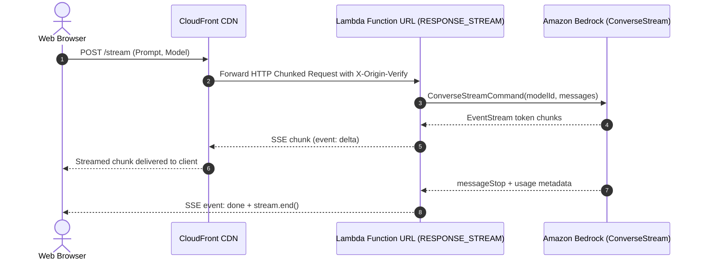

# Serverless Amazon Bedrock Token Streaming

This repository implements token-by-token response streaming from Amazon Bedrock models through AWS Lambda to web clients.

It uses AWS Lambda Function URLs configured with `InvokeMode: RESPONSE_STREAM`, which streams HTTP response chunks as Server-Sent Events (SSE). It includes both Node.js (Node.js 22 LTS) and Python implementations, AWS SAM and CDK infrastructure templates, and a local testing interface.

---

## Architecture Overview & Tradeoffs

When building generative AI interfaces on AWS, responses can take tens of seconds to complete. Exposing streams to frontends is typically done via one of two paths:

1. **Amazon API Gateway REST APIs (Transfer Mode: `STREAM`)**: API Gateway REST APIs support native response streaming and customizable integration timeouts. This is appropriate when you need API Gateway features such as usage plans, API keys, request validation, or Cognito authorizers. It incurs standard API Gateway request charges plus streaming data processing fees, and requires method-level configuration. Note that API Gateway HTTP APIs do not support response streaming and will buffer responses.
2. **AWS Lambda Function URLs (`InvokeMode: RESPONSE_STREAM`)**: Function URLs provide a direct HTTPS endpoint with native HTTP chunked transfer encoding. This eliminates the API Gateway layer and its per-request fees, but requires managing authentication and access control directly or via CloudFront.



---

## Security & Access Control

Exposing a Lambda Function URL that calls Amazon Bedrock requires explicit safeguards to prevent unauthorized inference charges:

* **Origin Verification:** Because CloudFront Origin Access Control (OAC) with Lambda Function URLs has limitations signing HTTP `POST` payloads, this template secures the Function URL origin using CloudFront custom headers (`X-Origin-Verify`). The Lambda handler rejects any direct requests that lack this secret header.
* **Model Allowlist:** Both Node.js and Python handlers enforce a server-side allowlist (`ALLOWED_MODELS`). Callers cannot invoke unapproved or expensive models by tampering with the request body.
* **Input Validation & Size Caps:** Prompts are capped at 4,000 characters and request bodies at 50 KB to block oversized payload abuse before calling Bedrock.
* **IAM Scoping:** Execution policies are pinned to specific foundation models (`amazon.nova-pro-v1:0`, `amazon.nova-lite-v1:0`, `anthropic.claude-3-5-haiku-20241022-v1:0`, `anthropic.claude-3-7-sonnet-20250219-v1:0`) and regional inference profile ARNs.
* **CORS:** The `CorsOrigin` parameter restricts allowed origins to your domain.

---

## Project Structure

* `lambda/index.mjs`: Node.js 22 streaming handler using `awslambda.streamifyResponse`, server-side model allowlist, and Bedrock `ConverseStreamCommand`.
* `lambda/python_adapter/main.py`: Python FastAPI service using AWS Lambda Web Adapter. It consumes the blocking Boto3 `converse_stream` iterator in a background worker thread and feeds an `asyncio.Queue` to prevent event-loop starvation.
* `lambda/python_adapter/Dockerfile`: Container image packaging FastAPI with the AWS Lambda Web Adapter.
* `infra/template.yaml`: AWS SAM template provisioning the Function URLs with `RESPONSE_STREAM`, pinned IAM policies, and CloudFront.
* `infra/cdk/lib/streaming-bedrock-stack.ts`: AWS CDK v2 TypeScript stack implementation.
* `frontend/`: Web interface (`index.html`, `style.css`, `app.js`) for testing the stream and viewing latency metrics.
* `blog/serverless-bedrock-token-streaming.md`: Technical article detailing the architecture, CloudFront policy requirements, and asyncio concurrency considerations.

---

## Deployment

### Prerequisites
* AWS CLI configured with credentials that have permissions to deploy Lambda, IAM, and CloudFront.
* Amazon Bedrock model access enabled in your region (default: `amazon.nova-pro-v1:0`).

### Deploy via AWS SAM

```bash
cd infra
sam build
sam deploy --guided
```

Key SAM parameters:
* `CorsOrigin`: Set to your frontend domain (e.g. `https://app.example.com`).
* `OriginVerifySecret`: Set a secure secret string for CloudFront origin verification.

Outputs:
* `NodeFunctionUrl`: Direct Lambda streaming endpoint.
* `CloudFrontDomain`: CloudFront distribution configured with `CachingDisabled` (`4135ea2d-6df8-44a3-9df3-44ca84e08fad`) and `AllViewerExceptHostHeader` (`b689b0a8-53d0-40ab-baf2-68738e2966ac`).

### Deploy via AWS CDK

```bash
cd infra/cdk
npm install
cdk deploy
```

---

## Local Development & Testing

### 1. Interactive Web Interface
Run a local static server to test the web client:

```bash
python -m http.server 3000 -d frontend
```

Open `http://localhost:3000`. By default, the interface includes a local simulator mode for testing the UI and stream parsing without AWS credentials. Enter your deployed CloudFront URL and uncheck simulator mode to test against live infrastructure.

### 2. Node.js Local Invocation
Run the local test harness to verify the handler:

```bash
cd lambda
npm install
node local-test.mjs
```

### 3. Python Adapter Local Invocation
```bash
cd lambda/python_adapter
pip install -r requirements.txt
python main.py
```
Test endpoint at `http://localhost:8080/stream`.

---

## Limitations & Tradeoffs

* **When API Gateway is Better:** If your application requires built-in API keys, tiered usage plans, request schema validation, or integration with existing REST API ecosystems, API Gateway REST APIs with `STREAM` transfer mode provide a more comprehensive platform.
* **Bandwidth Limits:** AWS Lambda response streaming delivers an initial 6 MB unthrottled burst, after which subsequent throughput is capped at 2 MB/s, with a maximum response payload of 200 MB.
* **Cost Risk:** Even with prompt caps and model allowlists, public-facing LLM endpoints can be abused to consume Bedrock quotas. For production applications, always place AWS WAF with rate limiting in front of CloudFront.
* **Note on Project Origin:** This reference architecture was initially scaffolded with AI assistance and subsequently reviewed, audited, and hardened against current AWS documentation.

---

## License
MIT
