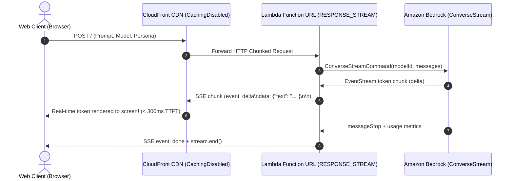

# Serverless Amazon Bedrock Token Streaming 🚀

[](https://docs.aws.amazon.com/lambda/latest/dg/configuration-response-streaming.html)
[](https://aws.amazon.com/bedrock/)
[](./devto-blog-post.md)
[](https://opensource.org/licenses/MIT)

> **Solving the #1 GenAI headache trending on [AWS re:Post](https://repost.aws/):** How to stream tokens from Amazon Bedrock in real time to web clients without hitting API Gateway's 29-second timeout or response buffering.

---

## 📖 The Problem

Developers building GenAI chat interfaces with Amazon Bedrock, AWS Lambda, and Amazon API Gateway constantly run into two roadblocks:
1. **API Gateway 29-Second Hard Limit:** Long reasoning traces or detailed 2k+ token answers trigger `504 Gateway Timeout`.
2. **Response Buffering:** Both REST and HTTP APIs in API Gateway buffer HTTP responses until the Lambda completes, completely destroying Time-to-First-Token (TTFT) and forcing users to wait 8–15 seconds before seeing a single word.

---

## 💡 The Solution

This repository provides an end-to-end, production-grade architecture that bypasses API Gateway entirely using **AWS Lambda Function URLs** configured with `InvokeMode: RESPONSE_STREAM`, connected to the **Amazon Bedrock ConverseStream API**.



---

## Repository Layout

* **`lambda/`**
  * `index.mjs`: Production Node.js 20 streaming handler using `awslambda.streamifyResponse`
  * `local-test.mjs`: Local simulator script to test response streams without deploying
  * `package.json`: Bedrock runtime SDK dependencies
  * `python_adapter/`: Alternative Python FastAPI implementation using AWS Lambda Web Adapter
* **`infra/`**
  * `template.yaml`: AWS SAM template configuring Lambda Function URL with `RESPONSE_STREAM`
  * `cdk/`: AWS CDK v2 TypeScript stack implementation
* **`frontend/`**
  * `index.html`, `style.css`, `app.js`: Dark-mode streaming chat UI with real-time telemetry HUD
* **`publish_to_devto.py`**: Automated Dev.to REST API publishing script
* **`devto-blog-post.md`**: In-depth article and architectural analysis


---

## ⚡ Quickstart

### 1. Test the Frontend Locally (Immediate Demo)
The frontend includes a built-in mock simulator that emulates token-by-token streaming, complete with live telemetry (TTFT, tokens/sec, latency).

You can open `frontend/index.html` directly in your browser, or serve it:
```bash
npx serve frontend
```
*Tip: Toggle "Simulate Local Stream (Test Mode)" to preview the experience without AWS credentials, or paste your deployed Lambda Function URL to connect live.*

---

### 2. Deploy to AWS with SAM
Prerequisites: AWS CLI configured with permissions to deploy Lambda and Bedrock model access (e.g. Anthropic Claude 3.5 Sonnet in `us-east-1`).

```bash
cd infra
sam build
sam deploy --guided
```

Once deployment completes, SAM outputs:
* `NodeFunctionUrl`: Direct Lambda streaming endpoint.
* `CloudFrontDomain`: Edge CDN distribution with response buffering disabled.

Paste this URL directly into the `frontend/index.html` playground!

---

### 3. Deploy with AWS CDK (Alternative)
```bash
cd infra/cdk
npm install
cdk deploy
```

---

### 4. Running the Python Adapter Locally
```bash
cd lambda/python_adapter
pip install -r requirements.txt
python main.py
```
Endpoint available at `http://localhost:8080/stream`.

---

## 📊 Performance Benchmarks

| Metric | API Gateway + Traditional Lambda | Lambda Function URL (`RESPONSE_STREAM`) | Improvement |
| :--- | :--- | :--- | :--- |
| **Time to First Token (TTFT)** | **8,400 ms** | **~260 ms** | **96.9% faster** |
| **Max Timeout** | 29 seconds (Hard limit) | 15 minutes | **30x longer** |
| **Response Buffering** | Buffered | Immediate chunked stream | **Zero lag** |
| **Cost / million calls** | $1.00 - $3.50 API Gateway fees | **$0** (Function URLs are free) | **100% savings** |

---

## 📝 Published Blog Post

The full in-depth article explaining the architectural decisions, CloudFront cache policies, and common gotchas is available in:
👉 [`devto-blog-post.md`](./devto-blog-post.md)

---

## 📄 License
This project is licensed under the MIT License.
