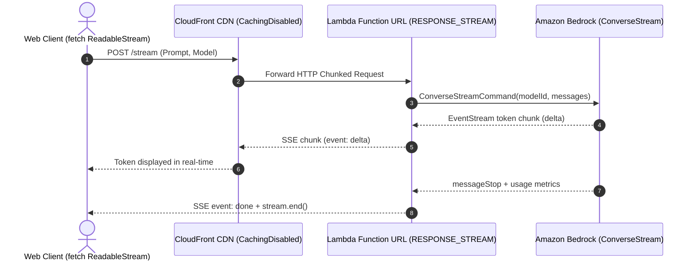

# Serverless Amazon Bedrock Token Streaming

[](https://docs.aws.amazon.com/lambda/latest/dg/configuration-response-streaming.html)
[](https://aws.amazon.com/bedrock/)
[](./blog/serverless-bedrock-token-streaming.md)
[](https://opensource.org/licenses/MIT)

A reference architecture for streaming generative AI tokens from Amazon Bedrock directly to web clients using **AWS Lambda Function URLs** in `RESPONSE_STREAM` mode with CloudFront.

---

## Architecture Overview

When building token-streaming applications with Amazon Bedrock, developers generally choose between two primary serverless patterns:

1. **Amazon API Gateway REST APIs with `STREAM` transfer mode** (native streaming support for REST APIs, with usage plans, API keys, and custom authorizers).
2. **AWS Lambda Function URLs with `RESPONSE_STREAM`** (direct HTTPS invocation, minimal proxy overhead, lower per-request cost, and native HTTP chunked streaming).

This repository demonstrates the Function URL pattern:



---

## Repository Layout

* **`lambda/`**
  * `index.mjs`: Node.js 20 streaming handler using `awslambda.streamifyResponse` and Bedrock ConverseStream
  * `local-test.mjs`: Local simulation script for testing stream behavior without AWS credentials
  * `package.json`: AWS SDK v3 Bedrock runtime dependencies
  * `python_adapter/`: Python FastAPI implementation using AWS Lambda Web Adapter with non-blocking async worker thread
* **`infra/`**
  * `template.yaml`: AWS SAM template with scoped IAM policies, configurable auth (`AWS_IAM` / `NONE`), and CloudFront
  * `cdk/`: AWS CDK v2 TypeScript stack implementation
* **`frontend/`**
  * `index.html`, `style.css`, `app.js`: Dark-mode testing playground with live telemetry HUD (TTFT, tokens/sec, latency)
* **`blog/`**
  * `serverless-bedrock-token-streaming.md`: Technical walkthrough and architectural analysis
* **`publish_to_devto.py`**: CLI script to publish or update the article on Dev.to

---

## Security Considerations

When deploying Function URLs connected to generative AI models:

* **Authentication:** The SAM template parameter `FunctionAuthType` defaults to `AWS_IAM`. In production, ensure requests are signed with AWS SigV4, or route through CloudFront with AWS WAF rate-limiting.
* **IAM Scope:** The execution role policy is scoped specifically to Bedrock foundation models (`arn:aws:bedrock:*::foundation-model/*`) and regional inference profile ARNs.
* **CORS:** Restrict `CorsOrigin` to your specific domain rather than wildcard `*` to prevent unauthorized origins from consuming model tokens.

---

## Quickstart

### 1. Test the Frontend Locally
Open `frontend/index.html` in your browser (or use `python -m http.server 3000 -d frontend`). The built-in simulator mode runs immediately without AWS deployment.

### 2. Deploy to AWS with SAM
```bash
cd infra
sam build
sam deploy --guided
```

Outputs:
* `NodeFunctionUrl`: Streaming Lambda endpoint
* `CloudFrontDomain`: Edge CDN distribution with `CachingDisabled` policy

---

## Detailed Article

For a deep dive into API Gateway tradeoffs, Python asyncio worker thread patterns, and CloudFront origin request policies, see:
[**`blog/serverless-bedrock-token-streaming.md`**](./blog/serverless-bedrock-token-streaming.md)

---

## License
MIT
