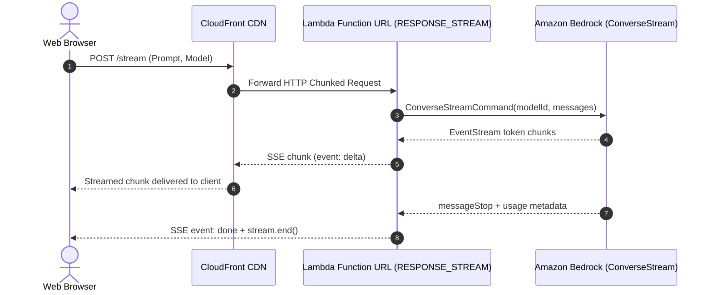

# Serverless Amazon Bedrock Token Streaming

This repository implements token-by-token response streaming from Amazon Bedrock models through AWS Lambda to web clients.

It uses AWS Lambda Function URLs configured with `InvokeMode: RESPONSE_STREAM`, which streams HTTP response chunks as Server-Sent Events (SSE). It includes both Node.js and Python implementations, AWS SAM and CDK infrastructure templates, and an interactive local testing interface.

---

## Background & Architecture Tradeoffs

When building generative AI interfaces on AWS, responses can take tens of seconds to complete. Exposing streams to frontends is typically done via one of two paths:

1. **Amazon API Gateway REST APIs (Transfer Mode: `STREAM`)**: API Gateway REST APIs support native response streaming and customizable timeouts. This is appropriate when you need API Gateway features such as usage plans, API keys, request validation, or Cognito authorizers, but incurs API Gateway per-request charges ($3.50 per million calls) and requires method-level configuration. Note that API Gateway HTTP APIs do not support response streaming and will buffer responses.
2. **AWS Lambda Function URLs (`InvokeMode: RESPONSE_STREAM`)**: Function URLs provide a direct HTTPS endpoint with native HTTP chunked transfer encoding. This eliminates the API Gateway layer and its per-request costs, but requires managing authentication and access control directly or via CloudFront.



---

## Security & Authentication

Deploying a Lambda Function URL that calls Amazon Bedrock without authentication and with wildcard CORS (`*`) creates a financial risk, as anyone with the URL can incur model inference charges.

This repository implements the following security controls:

* **Authentication:** The SAM template parameter `FunctionAuthType` defaults to `AWS_IAM`. Callers must sign requests with AWS SigV4. For browser clients that cannot sign with IAM, route through CloudFront with AWS WAF rate limiting, or validate an API key or JWT header at the application layer.
* **IAM Scoping:** Execution policies are scoped to foundation models (`arn:aws:bedrock:*::foundation-model/*`) and regional inference profile ARNs, rather than `Resource: "*"`.
* **CORS:** The `CorsOrigin` parameter restricts allowed origins to your domain.

---

## Project Structure

* `lambda/index.mjs`: Node.js 20 streaming handler using `awslambda.streamifyResponse` and the Bedrock `ConverseStreamCommand`.
* `lambda/python_adapter/main.py`: Python FastAPI service using AWS Lambda Web Adapter. It consumes the blocking Boto3 `converse_stream` iterator in a background worker thread and feeds an `asyncio.Queue` to prevent event-loop starvation.
* `lambda/python_adapter/Dockerfile`: Container image packaging FastAPI with the AWS Lambda Web Adapter.
* `infra/template.yaml`: AWS SAM template provisioning the Function URLs with `RESPONSE_STREAM`, scoped IAM policies, and CloudFront.
* `infra/cdk/lib/streaming-bedrock-stack.ts`: AWS CDK v2 TypeScript stack implementation.
* `frontend/`: Web interface (`index.html`, `style.css`, `app.js`) for testing the stream and viewing latency metrics.
* `blog/serverless-bedrock-token-streaming.md`: Technical article detailing the architecture, CloudFront policy requirements, and asyncio concurrency considerations.

---

## Deployment

### Prerequisites
* AWS CLI configured with credentials that have permissions to deploy Lambda, IAM, and CloudFront.
* Amazon Bedrock model access enabled in your region (default: `us.anthropic.claude-3-7-sonnet-20250219-v1:0` or `amazon.nova-pro-v1:0`).

### Deploy via AWS SAM

```bash
cd infra
sam build
sam deploy --guided
```

Key SAM parameters:
* `FunctionAuthType`: Set to `AWS_IAM` for production, or `NONE` for sandbox testing behind an API key.
* `CorsOrigin`: Set to your frontend domain (e.g. `https://app.example.com`).

Outputs:
* `NodeFunctionUrl`: Direct Lambda streaming endpoint.
* `CloudFrontDomain`: CloudFront distribution configured with `CachingDisabled` (`4135ea2d-6df8-44a3-9df3-44ca84e08fad`) and `AllViewerExceptHostHeader` (`b689b0a8-53d0-40ab-baf2-68738e2966ac`).

### Deploy via AWS CDK

```bash
cd infra/cdk
npm install
cdk deploy
```

---

## Local Development & Testing

### 1. Interactive Web Interface
Run a local static server to test the web client:

```bash
python -m http.server 3000 -d frontend
```

Open `http://localhost:3000`. By default, the interface includes a local simulator mode for testing the UI and stream parsing without AWS credentials. Enter your deployed Function URL and uncheck simulator mode to test against live infrastructure.

### 2. Node.js Local Invocation
Run the local test harness to verify the handler:

```bash
cd lambda
npm install
node local-test.mjs
```

### 3. Python Adapter Local Invocation
```bash
cd lambda/python_adapter
pip install -r requirements.txt
python main.py
```
Test endpoint at `http://localhost:8080/stream`.

---

## License
MIT
