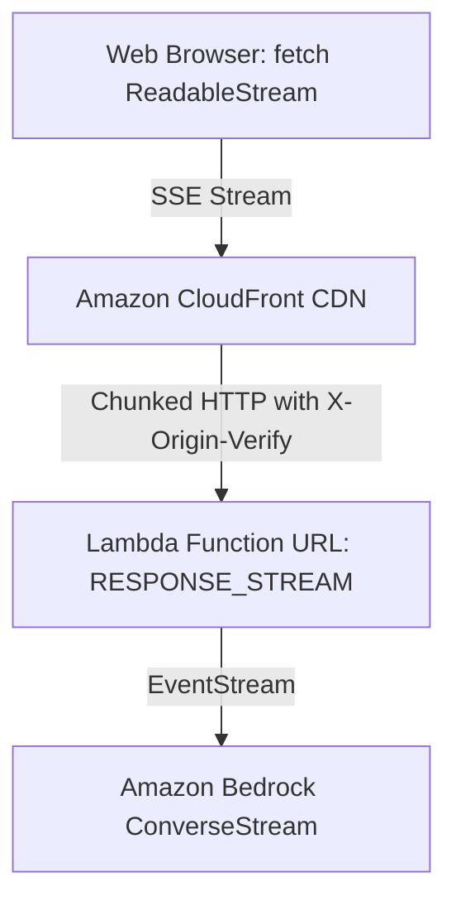

When building interactive generative AI applications on AWS, managing Time-To-First-Token (TTFT) is critical. While Amazon Bedrock natively supports streaming token responses via its `ConverseStream` API, exposing this stream to client browsers over serverless infrastructure requires choosing the right architectural path.

In this guide, we examine the mechanics of serverless token streaming on AWS, compare **API Gateway REST APIs** with **Lambda Function URLs in `RESPONSE_STREAM` mode**, resolve a common **Python asyncio event loop blocking bug**, and address the **security and billing safeguards** needed before exposing model endpoints.

---

## 1. The Architectural Landscape: Function URLs vs. API Gateway

When serving streaming LLM responses, AWS offers two primary serverless patterns:

### Option A: Amazon API Gateway REST APIs (Response Transfer Mode: `STREAM`)
AWS supports native response streaming for API Gateway REST APIs, allowing integrations to stream response payloads without buffering.
* **Pros:** Full access to API Gateway features (API keys, usage plans, request validation, Cognito/Lambda authorizers).
* **Cons:** Requires configuring method response transfer modes (`STREAM`), incurs API Gateway per-request invocation charges plus streaming data processing fees, and does not apply to API Gateway HTTP APIs (which still buffer responses).

### Option B: AWS Lambda Function URLs (`InvokeMode: RESPONSE_STREAM`)
Lambda Function URLs provide a direct HTTPS endpoint backed by HTTP chunked transfer encoding.
* **Pros:** Zero API Gateway provisioning overhead, zero per-request proxy fees, native chunked streaming, and direct support up to Lambda's 15-minute execution limit.
* **Cons:** Fewer built-in API management features; authentication must be managed via CloudFront with origin verification, AWS WAF, or an application-layer check.



---

## 2. Latency & TTFT: Qualitative Behavior

To illustrate the user experience impact, consider a model generating a multi-paragraph response:

* **Buffered Response:** The client receives zero bytes until generation is complete. The Time-To-First-Token equals the full generation duration (typically several seconds depending on model throughput).
* **Streaming Response:** The client receives the initial token chunk as soon as the model finishes prefill processing and begins generation. The user can start reading immediately while subsequent tokens stream in over Server-Sent Events (SSE).

---

## 3. Node.js 22 Implementation

AWS Lambda supports native response streaming in Node.js via `awslambda.streamifyResponse()` and `awslambda.HttpResponseStream`.

```javascript
// lambda/index.mjs
import {
  BedrockRuntimeClient,
  ConverseStreamCommand,
} from "@aws-sdk/client-bedrock-runtime";

const bedrock = new BedrockRuntimeClient({
  region: process.env.AWS_REGION || "us-east-1",
});

// Pinned server-side model allowlist
const ALLOWED_MODELS = new Set([
  "amazon.nova-pro-v1:0",
  "amazon.nova-lite-v1:0",
  "us.anthropic.claude-3-7-sonnet-20250219-v1:0",
  "us.anthropic.claude-3-5-haiku-20241022-v1:0",
]);

const DEFAULT_MODEL_ID = process.env.BEDROCK_MODEL_ID || "amazon.nova-pro-v1:0";
const ALLOWED_ORIGIN = process.env.ALLOWED_ORIGIN || "https://yourdomain.com";
const EXPECTED_ORIGIN_VERIFY = process.env.ORIGIN_VERIFY_SECRET;

const MAX_PROMPT_CHARS = 4000;
const MAX_BODY_BYTES = 50 * 1024; // 50 KB

export const handler = awslambda.streamifyResponse(
  async (event, responseStream, context) => {
    const headers = {
      "Content-Type": "text/event-stream; charset=utf-8",
      "Cache-Control": "no-cache, no-transform",
      "Connection": "keep-alive",
      "X-Accel-Buffering": "no",
      "Access-Control-Allow-Origin": ALLOWED_ORIGIN,
      "Access-Control-Allow-Methods": "POST, OPTIONS",
      "Access-Control-Allow-Headers": "Content-Type, Authorization, x-origin-verify",
    };

    if (event.requestContext?.http?.method === "OPTIONS") {
      const corsResponse = awslambda.HttpResponseStream.from(responseStream, {
        statusCode: 204,
        headers,
      });
      corsResponse.end();
      return;
    }

    // Origin verification guard: Ensures requests route through CloudFront
    if (EXPECTED_ORIGIN_VERIFY) {
      const originHeader = event.headers?.["x-origin-verify"] || event.headers?.["X-Origin-Verify"];
      if (originHeader !== EXPECTED_ORIGIN_VERIFY) {
        const forbiddenResponse = awslambda.HttpResponseStream.from(responseStream, {
          statusCode: 403,
          headers: { "Content-Type": "application/json", "Access-Control-Allow-Origin": ALLOWED_ORIGIN },
        });
        forbiddenResponse.write(JSON.stringify({ error: "Forbidden: Direct Function URL access is blocked." }));
        forbiddenResponse.end();
        return;
      }
    }

    // Payload size guard
    const rawBody = event.body || "";
    if (Buffer.byteLength(rawBody, "utf8") > MAX_BODY_BYTES) {
      const sizeErrResponse = awslambda.HttpResponseStream.from(responseStream, {
        statusCode: 413,
        headers: { "Content-Type": "application/json", "Access-Control-Allow-Origin": ALLOWED_ORIGIN },
      });
      sizeErrResponse.write(JSON.stringify({ error: "Payload too large. Maximum allowed is 50 KB." }));
      sizeErrResponse.end();
      return;
    }

    const stream = awslambda.HttpResponseStream.from(responseStream, {
      statusCode: 200,
      headers,
    });

    const sendSSE = (data, eventType = "message") => {
      const payload = typeof data === "string" ? data : JSON.stringify(data);
      stream.write(`event: ${eventType}\ndata: ${payload}\n\n`);
    };

    try {
      const body = event.body ? JSON.parse(event.body) : {};
      const prompt = String(body.prompt || "Explain distributed consensus in two sentences.");
      const modelId = String(body.modelId || DEFAULT_MODEL_ID);

      if (prompt.length > MAX_PROMPT_CHARS) {
        sendSSE({ error: true, message: `Prompt exceeds ${MAX_PROMPT_CHARS} character limit.` }, "error");
        stream.end();
        return;
      }

      if (!ALLOWED_MODELS.has(modelId)) {
        sendSSE({ error: true, message: `Model '${modelId}' is not permitted.` }, "error");
        stream.end();
        return;
      }

      sendSSE({ status: "connected", modelId }, "init");

      const command = new ConverseStreamCommand({
        modelId,
        messages: [{ role: "user", content: [{ text: prompt }] }],
        inferenceConfig: { maxTokens: 2048, temperature: 0.7 },
      });

      const response = await bedrock.send(command);

      for await (const chunk of response.stream) {
        if (chunk.contentBlockDelta?.delta?.text) {
          sendSSE({ text: chunk.contentBlockDelta.delta.text }, "delta");
        }
        if (chunk.messageStop) {
          sendSSE({ stopReason: chunk.messageStop.stopReason }, "done");
        }
      }
    } catch (err) {
      console.error("Bedrock stream error:", err);
      sendSSE({ error: true, message: err.message }, "error");
    } finally {
      stream.end();
    }
  }
);
```

---

## 4. Python Concurrency Gotcha: Non-Blocking Stream Consumption

A common pitfall when building Python streaming services with FastAPI and Boto3 is how the Bedrock stream is consumed:

```python
# WARNING: Flawed Pattern
response = await loop.run_in_executor(None, lambda: bedrock.converse_stream(...))
for event in response.get("stream"):  # BLOCKS the asyncio event loop!
    await asyncio.sleep(0)            # Does NOT fix synchronous socket reads
    yield event
```

`response.get("stream")` is a `botocore.eventstream.EventStream`. Its iterator performs synchronous, blocking network socket reads. Iterating over it directly inside an `async def` generator blocks the entire asyncio event loop thread while waiting for the next token, causing concurrent requests to stall.

### The Correct Pattern: Producer-Consumer via `asyncio.Queue`

Offload the synchronous stream iteration to a background worker thread, pushing events into an `asyncio.Queue`:

```python
# lambda/python_adapter/main.py
import os
import json
import asyncio
import threading
from typing import AsyncGenerator
import boto3
from fastapi import FastAPI, HTTPException
from fastapi.responses import StreamingResponse
from pydantic import BaseModel, Field

app = FastAPI()
bedrock = boto3.client("bedrock-runtime", region_name="us-east-1")
_STREAM_END = object()

ALLOWED_MODELS = {
    "amazon.nova-pro-v1:0",
    "amazon.nova-lite-v1:0",
    "us.anthropic.claude-3-7-sonnet-20250219-v1:0",
    "us.anthropic.claude-3-5-haiku-20241022-v1:0",
}

class ChatRequest(BaseModel):
    prompt: str = Field(..., max_length=4000)
    modelId: str = Field("amazon.nova-pro-v1:0")

async def stream_bedrock_events(request: ChatRequest) -> AsyncGenerator[str, None]:
    if request.modelId not in ALLOWED_MODELS:
        yield f"event: error\ndata: {json.dumps({'error': f'Model {request.modelId} not allowed.'})}\n\n"
        return

    queue = asyncio.Queue()
    loop = asyncio.get_running_loop()

    def worker():
        try:
            response = bedrock.converse_stream(
                modelId=request.modelId,
                messages=[{"role": "user", "content": [{"text": request.prompt}]}],
            )
            for event in response.get("stream"):
                loop.call_soon_threadsafe(queue.put_nowait, event)
            loop.call_soon_threadsafe(queue.put_nowait, _STREAM_END)
        except Exception as e:
            loop.call_soon_threadsafe(queue.put_nowait, e)

    threading.Thread(target=worker, daemon=True).start()

    yield f"event: init\ndata: {json.dumps({'status': 'connected'})}\n\n"

    while True:
        item = await queue.get()
        if item is _STREAM_END:
            break
        if isinstance(item, Exception):
            yield f"event: error\ndata: {json.dumps({'error': str(item)})}\n\n"
            break

        if "contentBlockDelta" in item:
            text = item["contentBlockDelta"]["delta"]["text"]
            yield f"event: delta\ndata: {json.dumps({'text': text})}\n\n"
        elif "messageStop" in item:
            yield f"event: done\ndata: {json.dumps({'status': 'complete'})}\n\n"

@app.post("/stream")
async def chat_endpoint(req: ChatRequest):
    return StreamingResponse(
        stream_bedrock_events(req),
        media_type="text/event-stream",
        headers={"Cache-Control": "no-cache", "X-Accel-Buffering": "no"},
    )
```

Pair this with the **AWS Lambda Web Adapter** (`AWS_LWA_INVOKE_MODE=response_stream`) in a container image to run standard FastAPI on Lambda Function URLs.

---

## 5. Security & Billing Safeguards: Critical Checklist

Exposing a Lambda Function URL that calls Amazon Bedrock requires explicit access control. Deploying without origin protection and with unrestricted IAM permissions creates severe financial exposure—anyone who discovers the URL can invoke the model and drive up AWS charges.

### Production Hardening Steps:

1. **Origin Verification with CloudFront:** Because CloudFront Origin Access Control (OAC) with Lambda Function URLs has limitations signing HTTP `POST` request bodies, forward a custom header (`X-Origin-Verify`) containing a shared secret from CloudFront, and validate it in the Lambda handler to reject direct calls.
2. **Scope IAM Execution Roles:** Never grant `Resource: "*"`. Pin the Lambda execution policy strictly to the specific foundation model ARNs and regional inference profile ARNs:
   ```yaml
   - Effect: Allow
     Action:
       - bedrock:InvokeModelWithResponseStream
       - bedrock:ConverseStream
     Resource:
       - !Sub "arn:${AWS::Partition}:bedrock:${AWS::Region}::foundation-model/amazon.nova-pro-v1:0"
       - !Sub "arn:${AWS::Partition}:bedrock:${AWS::Region}::foundation-model/amazon.nova-lite-v1:0"
       - !Sub "arn:${AWS::Partition}:bedrock:${AWS::Region}::foundation-model/anthropic.claude-3-5-haiku-20241022-v1:0"
       - !Sub "arn:${AWS::Partition}:bedrock:${AWS::Region}::foundation-model/anthropic.claude-3-7-sonnet-20250219-v1:0"
       - !Sub "arn:${AWS::Partition}:bedrock:${AWS::Region}:${AWS::AccountId}:inference-profile/*"
   ```
3. **Restrict CORS:** Explicitly whitelist your domain in `AllowOrigins`. Wildcard CORS (`*`) allows unauthorized web origins to make cross-site calls to your endpoint.
4. **Deploy CloudFront with AWS WAF:** Place AWS WAF in front of CloudFront to enforce rate limits, geo-restrictions, and bot control.
5. **Enforce a Server-Side Model Allowlist:** Never allow clients to pass arbitrary `modelId` values. Validate incoming model IDs against a strict server-side allowlist.
6. **Input Validation & Payload Guards:** Validate prompt character lengths (e.g., max 4,000 characters) and request body sizes (e.g., max 50 KB) before dispatching to Bedrock.

### Response Streaming Bandwidth and Cost Notes
* **Bandwidth Behavior:** AWS Lambda response streaming delivers an initial 6 MB unthrottled burst, after which subsequent throughput is capped at 2 MB/s (16 Mbps), up to a maximum payload size of 200 MB. For text-based LLM token streaming, this bandwidth ceiling is far higher than the generation throughput of current foundation models.
* **Billing Mechanics:** While Function URLs avoid API Gateway request invocation fees, standard Lambda execution duration (billed in 1ms increments), memory allocation, and AWS Data Transfer Out still apply.

---

## 6. CloudFront CDN Configuration

When routing CloudFront to a streaming Lambda Function URL, two AWS-managed policies are required:

1. **`CachePolicyId: 4135ea2d-6df8-44a3-9df3-44ca84e08fad` (CachingDisabled):** Ensures CloudFront forwards chunks immediately without buffering.
2. **`OriginRequestPolicyId: b689b0a8-53d0-40ab-baf2-68738e2966ac` (AllViewerExceptHostHeader):** Strips the client's `Host` header and replaces it with the Lambda Function URL domain. Without this policy, the Lambda service rejects incoming requests because the `Host` header does not match the origin.

---

## 7. Limitations & Tradeoffs

* **When API Gateway is Better:** If your application requires built-in API keys, tiered usage plans, request schema validation, or integration with existing REST API ecosystems, API Gateway REST APIs with `STREAM` transfer mode provide a more comprehensive platform.
* **Cost Risk:** Even with prompt caps and model allowlists, public-facing LLM endpoints can be abused to consume Bedrock quotas. For production applications, always place AWS WAF with rate limiting in front of CloudFront.
* **Note on Project Origin:** This reference architecture was initially scaffolded with AI assistance and subsequently reviewed, audited, and hardened against current AWS documentation.

---

## Conclusion & Code Repository

Serverless token streaming with Amazon Bedrock provides an effective balance between low latency and cost efficiency. Whether you choose API Gateway REST APIs in `STREAM` mode or direct Lambda Function URLs, ensuring non-blocking event loop iteration in Python and locking down authentication and CORS are essential for production readiness.

The complete code, SAM template, and CDK stack are open-source and available here:

🔗 **GitHub Repository:** [sharma-the-karma/serverless-bedrock-token-streaming](https://github.com/sharma-the-karma/serverless-bedrock-token-streaming)
