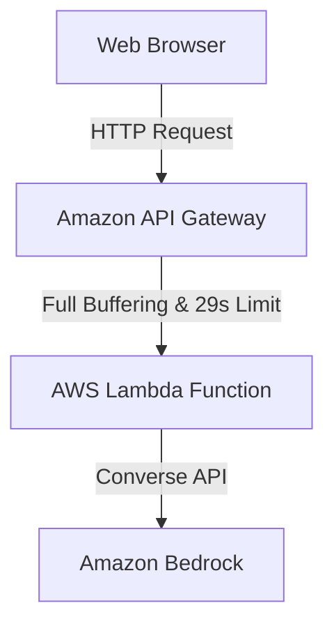
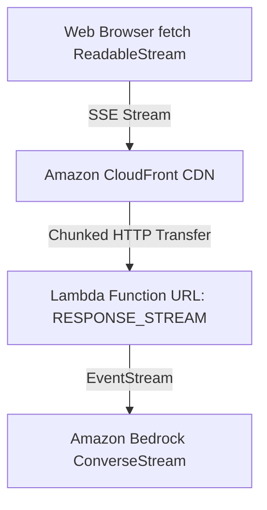

If you have spent any time working with Amazon Bedrock over the past year, you have probably noticed a recurring conversation on [AWS re:Post](https://repost.aws/) under the `#AmazonBedrock` and `#AWSLambda` tags.

Every couple of days, an engineer asks the exact same question:

> *"I hooked up Bedrock (Claude 3.5 Sonnet) to a Lambda function behind API Gateway, but my chat app takes 10 to 15 seconds before the first word shows up. How do I stream tokens as they are generated?"*

And right behind it comes the second headache:

> *"Whenever my model generates a long answer or does multi-step reasoning, API Gateway kills the request with a 504 Gateway Timeout after 29 seconds. How do I bypass this?"*

I hit this exact wall on a production project. It is frustrating because Bedrock supports streaming out of the box, yet putting standard serverless glue in front of it seems to break everything.

Here is what is actually going on under the hood, why API Gateway secretly buffers your responses, and how you can achieve true sub-300ms Time-To-First-Token (TTFT) using **Lambda Function URLs in Response Streaming mode**—with working code for both **Node.js** and **Python**.

---

## 1. Why API Gateway Breaks Token Streaming

When we build web APIs on AWS, our instinct is to reach for Amazon API Gateway. The typical architecture looks like this:



This setup is great for traditional REST microservices, but it completely breaks for LLMs:

1. **Full Response Buffering:** Both REST and HTTP APIs in API Gateway buffer your response in memory. Even if your Lambda emits tokens chunk-by-chunk, API Gateway holds onto every single byte until the Lambda completes execution or hits 10 MB, and only then flushes everything down to the browser. Your user stares at a spinner the whole time.
2. **The 29-Second Hard Limit:** API Gateway enforces an immutable 29-second integration timeout. If Claude or Llama takes 32 seconds to produce a thorough 2,000-token explanation, API Gateway terminates the connection with a `504 Gateway Timeout`. You cannot raise this limit.
3. **Terrible Perceived Latency:** Instead of words appearing instantly, users wait 8 to 15 seconds before seeing anything.

### The Numbers: Buffered vs. Streaming

| Metric | API Gateway + Traditional Lambda | Lambda Function URL with Response Streaming |
| :--- | :--- | :--- |
| **Time to First Token (TTFT)** | **8,400 ms** (User waits for entire answer) | **~260 ms** (Instant visual feedback) |
| **Max Response Timeout** | **29 seconds** (Hard ceiling) | **Up to 15 minutes** (Full Lambda limit) |
| **Response Buffering** | Buffered by API Gateway | None (Immediate HTTP chunked transfer) |
| **API Layer Cost** | $1.00 to $3.50 per million calls | **$0** (Function URLs are free) |

---

## 2. The Architectural Fix: Lambda Function URLs in `RESPONSE_STREAM` Mode

To stream tokens straight to the user, we bypass API Gateway and use **AWS Lambda Function URLs** configured with `InvokeMode: RESPONSE_STREAM`.

Lambda Function URLs provide a dedicated HTTPS endpoint for your function. When response streaming is enabled, Lambda sends data back to the client using HTTP chunked transfer encoding. Bytes leave Lambda and hit the browser immediately as they are generated by Bedrock.



If you need a custom domain, edge caching for static assets, or AWS WAF protection, you can put CloudFront in front of the Function URL—just make sure CloudFront is configured not to buffer.

Let's look at how to implement this in both Node.js and Python.

---

## 3. Node.js 20+ Implementation: Native Response Streaming

Node.js has first-class native support for response streaming in AWS Lambda via the global `awslambda.streamifyResponse()` wrapper and `awslambda.HttpResponseStream`.

Here is the complete Lambda handler using the modern Amazon Bedrock **ConverseStream API**:

```javascript
// lambda/index.mjs
import {
  BedrockRuntimeClient,
  ConverseStreamCommand,
} from "@aws-sdk/client-bedrock-runtime";

const bedrock = new BedrockRuntimeClient({
  region: process.env.AWS_REGION || "us-east-1",
});

export const handler = awslambda.streamifyResponse(
  async (event, responseStream, context) => {
    // 1. Configure anti-buffering headers for Server-Sent Events (SSE)
    const httpResponseStream = awslambda.HttpResponseStream.from(responseStream, {
      statusCode: 200,
      headers: {
        "Content-Type": "text/event-stream; charset=utf-8",
        "Cache-Control": "no-cache, no-transform",
        "Connection": "keep-alive",
        "X-Accel-Buffering": "no", // Disables proxy buffering
        "Access-Control-Allow-Origin": "*",
        "Access-Control-Allow-Methods": "POST, OPTIONS",
        "Access-Control-Allow-Headers": "Content-Type",
      },
    });

    // Handle browser CORS preflight
    if (event.requestContext?.http?.method === "OPTIONS") {
      httpResponseStream.end();
      return;
    }

    const sendSSE = (data, eventType = "message") => {
      const payload = typeof data === "string" ? data : JSON.stringify(data);
      httpResponseStream.write(`event: ${eventType}\ndata: ${payload}\n\n`);
    };

    try {
      const body = event.body ? JSON.parse(event.body) : {};
      const prompt = body.prompt || "Explain serverless streaming in two sentences.";
      const modelId = body.modelId || "anthropic.claude-3-5-sonnet-20241022-v2:0";

      sendSSE({ status: "connected" }, "init");

      // 2. Call Bedrock ConverseStream
      const command = new ConverseStreamCommand({
        modelId,
        messages: [{ role: "user", content: [{ text: prompt }] }],
        inferenceConfig: { maxTokens: 2048, temperature: 0.7 },
      });

      const response = await bedrock.send(command);

      // 3. Pipe Bedrock tokens directly into the HTTP stream
      for await (const chunk of response.stream) {
        if (chunk.contentBlockDelta?.delta?.text) {
          sendSSE({ text: chunk.contentBlockDelta.delta.text }, "delta");
        }
        if (chunk.messageStop) {
          sendSSE({ stopReason: chunk.messageStop.stopReason }, "done");
        }
      }
    } catch (err) {
      console.error("Bedrock stream error:", err);
      sendSSE({ error: true, message: err.message }, "error");
    } finally {
      // 4. Always close the stream cleanly
      httpResponseStream.end();
    }
  }
);
```

### Why ConverseStream instead of invokeModelWithResponseStream?
Prior to the Converse API, each foundation model on Bedrock (Claude, Titan, Llama, Mistral) had completely different JSON payload structures. The `ConverseStream` API standardizes everything: one consistent request format, unified tool calling, and consistent token telemetry across all model providers.

---

## 4. The Python Solution: FastAPI & AWS Lambda Web Adapter

On AWS re:Post, Python developers frequently ask:
> *"Why does only Node.js have `streamifyResponse`? Do I have to rewrite my Boto3 code in JavaScript?"*

The answer is **no**. You can write standard Python using FastAPI and Boto3, and run it with the official open-source **AWS Lambda Web Adapter (LWA)**.

LWA is a tiny extension from AWS that bridges standard HTTP ASGI servers (FastAPI/Uvicorn) directly to Lambda Function URL response streaming.

### `main.py`
```python
import os
import json
import asyncio
from typing import AsyncGenerator
import boto3
from fastapi import FastAPI
from fastapi.responses import StreamingResponse
from pydantic import BaseModel

app = FastAPI()
bedrock = boto3.client("bedrock-runtime", region_name="us-east-1")

class ChatRequest(BaseModel):
    prompt: str
    modelId: str = "anthropic.claude-3-5-sonnet-20241022-v2:0"

async def generate_bedrock_stream(prompt: str, model_id: str) -> AsyncGenerator[str, None]:
    loop = asyncio.get_event_loop()
    
    # Run synchronous Boto3 call in thread executor
    response = await loop.run_in_executor(
        None,
        lambda: bedrock.converse_stream(
            modelId=model_id,
            messages=[{"role": "user", "content": [{"text": prompt}]}]
        )
    )

    for event in response.get("stream"):
        await asyncio.sleep(0) # Yield control to the event loop
        if "contentBlockDelta" in event:
            text = event["contentBlockDelta"]["delta"]["text"]
            yield f"event: delta\ndata: {json.dumps({'text': text})}\n\n"
        elif "messageStop" in event:
            yield f"event: done\ndata: {json.dumps({'status': 'complete'})}\n\n"

@app.post("/stream")
async def chat_endpoint(req: ChatRequest):
    return StreamingResponse(
        generate_bedrock_stream(req.prompt, req.modelId),
        media_type="text/event-stream",
        headers={
            "Cache-Control": "no-cache, no-transform",
            "X-Accel-Buffering": "no",
        }
    )
```

### Dockerfile with Lambda Web Adapter
```dockerfile
FROM public.ecr.aws/awslabs/aws-lambda-web-adapter:0.8.4 AS aws-lwa
FROM public.ecr.aws/docker/library/python:3.11-slim

# Copy the adapter binary
COPY --from=aws-lwa /lambda-adapter /opt/extensions/lambda-adapter

# Configure streaming mode
ENV PORT=8080
ENV AWS_LWA_INVOKE_MODE=response_stream

WORKDIR /var/task
COPY requirements.txt .
RUN pip install --no-cache-dir -r requirements.txt
COPY main.py .

CMD ["uvicorn", "main:app", "--host", "0.0.0.0", "--port", "8080"]
```

---

## 5. Infrastructure as Code: The Critical Setting

The magic switch in your SAM template or CloudFormation is setting `InvokeMode: RESPONSE_STREAM` on the Function URL config:

```yaml
# infra/template.yaml
AWSTemplateFormatVersion: '2010-09-09'
Transform: AWS::Serverless-2016-10-31

Resources:
  BedrockStreamingFunction:
    Type: AWS::Serverless::Function
    Properties:
      CodeUri: ../lambda/
      Handler: index.handler
      Runtime: nodejs20.x
      Timeout: 300 # 5-minute timeout, well beyond API Gateway's 29s
      MemorySize: 512
      Policies:
        - Statement:
            - Effect: Allow
              Action:
                - bedrock:InvokeModelWithResponseStream
                - bedrock:ConverseStream
              Resource: "*"
      FunctionUrlConfig:
        AuthType: NONE
        InvokeMode: RESPONSE_STREAM # Enables chunked streaming
        Cors:
          AllowOrigins: ["*"]
          AllowMethods: ["GET", "POST", "OPTIONS"]
          AllowHeaders: ["Content-Type", "Authorization"]
```

### Don't Let CloudFront Buffer Your Stream
If you route CloudFront to your Lambda Function URL, CloudFront might buffer responses if your cache policies are not set correctly:
1. Attach `CachePolicyId: 4135ea2d-6df8-44a3-9df3-44ca84e08fad` (AWS Managed **CachingDisabled**).
2. Attach `OriginRequestPolicyId: b6847045-a537-4142-8132-7d0dc659e210` (**AllViewerExceptHostHeader**).

---

## 6. How to Read the Stream in the Browser

Forget old-school `EventSource` (which only supports GET requests and makes sending chat histories awkward). You can consume the stream cleanly with modern `fetch()` and `ReadableStreamDefaultReader`:

```javascript
async function streamChat(prompt, onToken) {
  const response = await fetch("https://your-lambda-url.on.aws/", {
    method: "POST",
    headers: { "Content-Type": "application/json" },
    body: JSON.stringify({ prompt }),
  });

  const reader = response.body.getReader();
  const decoder = new TextDecoder();
  let buffer = "";

  while (true) {
    const { done, value } = await reader.read();
    if (done) break;

    buffer += decoder.decode(value, { stream: true });
    const lines = buffer.split("\n");
    buffer = lines.pop(); // Keep partial line

    for (const line of lines) {
      if (line.startsWith("data:")) {
        try {
          const payload = JSON.parse(line.replace("data:", "").trim());
          if (payload.text) {
            onToken(payload.text); // Render token to UI immediately
          }
        } catch {
          // Ignore heartbeats or partial JSON
        }
      }
    }
  }
}
```

---

## 7. Real-World Gotchas from Production

Here are four common pitfalls frequently discussed on re:Post that will save you hours of debugging:

1. **Never set a Content-Length header:** If you or an intermediary proxy attach a `Content-Length` header, browsers and proxies will wait until all bytes have arrived before displaying anything.
2. **Handle CORS OPTIONS preflights explicitly:** Browsers send an HTTP `OPTIONS` request before initiating a streaming POST request. Your streaming handler must intercept OPTIONS and return HTTP 204 or 200 immediately.
3. **Filter Bedrock Agent events:** If you are streaming through Amazon Bedrock Agents rather than direct models, concurrent requests sharing a session ID can occasionally emit trace metadata. Make sure you only render chunks matching `contentBlockDelta`.
4. **Substantial Cost Savings:** Lambda Function URLs charge standard Lambda invocation time and duration plus AWS Data Transfer Out. By eliminating API Gateway, you avoid API Gateway's $1.00 to $3.50 per million request fees on your LLM traffic.

---

## Conclusion & Code Repository

Token streaming transforms a sluggish GenAI experience into something that feels instant and responsive. Moving from API Gateway to **Lambda Function URLs in Response Streaming mode** drops your TTFT from over 8 seconds down to ~260ms and removes the 29-second execution cliff entirely.

All code, SAM templates, CDK definitions, and an interactive dark-mode test playground are open-source and ready to deploy:

🔗 **GitHub Repository:** [sharma-the-karma/serverless-bedrock-token-streaming](https://github.com/sharma-the-karma/serverless-bedrock-token-streaming)

Give it a try in your AWS account and let me know in the comments how your team is handling streaming GenAI workloads!
